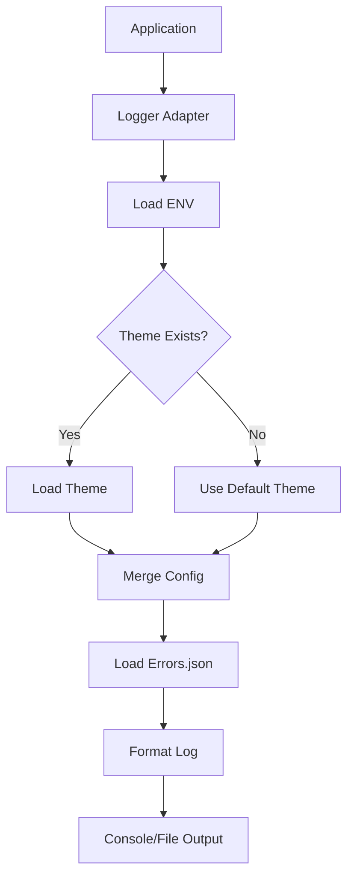
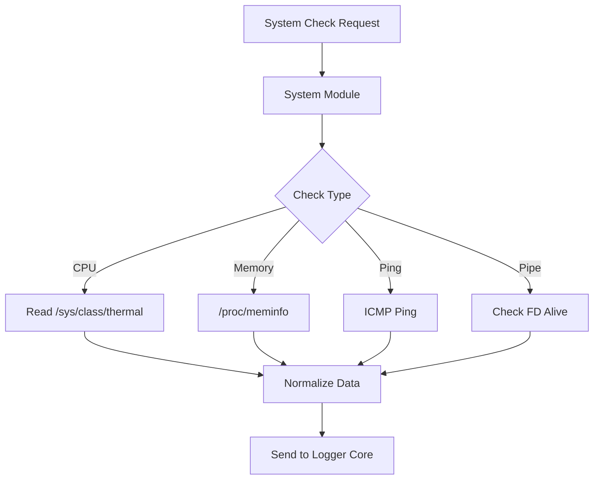
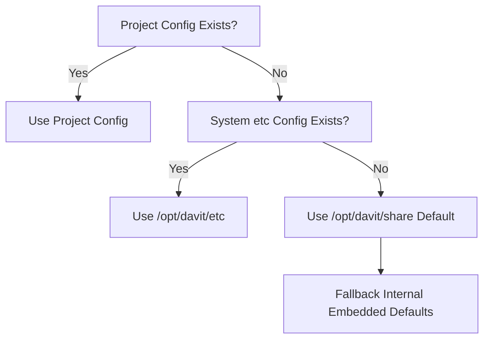

# MERMAID_DIAGRAMS

## Basic Logging Flow

```mermaid
flowchart TD
    A[Application] --> B[Logger Adapter]
    B --> C[Load ENV]
    C --> D{Theme Exists?}
    D -->|Yes| E[Load Theme]
    D -->|No| F[Use Default Theme]
    E --> G[Merge Config]
    F --> G
    G --> H[Load Errors.json]
    H --> I[Format Log]
    I --> J[Console/File Output]
```

## Advanced System Logging Flow

```mermaid
flowchart TD
    A[System Check Request] --> B[System Module]
    B --> C{Check Type}
    C -->|CPU| D[Read /sys/class/thermal]
    C -->|Memory| E[""/proc/meminfo]
    C -->|Ping| F[ICMP Ping]
    C -->|Pipe| G[Check FD Alive]
    D --> H[Normalize Data]
    E --> H
    F --> H
    G --> H
    H --> I[Send to Logger Core]
```

## Config Resolution Flow

```mermaid
flowchart TD
    A[Project Config Exists?] -->|Yes| B[Use Project Config]
    A -->|No| C[System etc Config Exists?]
    C -->|Yes| D[Use /opt/davit/etc]
    C -->|No| E[Use /opt/davit/share Default]
    E --> F[Fallback Internal Embedded Defaults]
```

